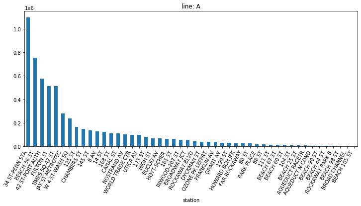

Forked from [ZachHeick](https://github.com/ZachHeick/MTA_Data_Analysis).

Changed it in a way that you can select the specific subway lines you interested for analysis.

Sample output images: Average weekly entries in Line A and Line L of NYC

